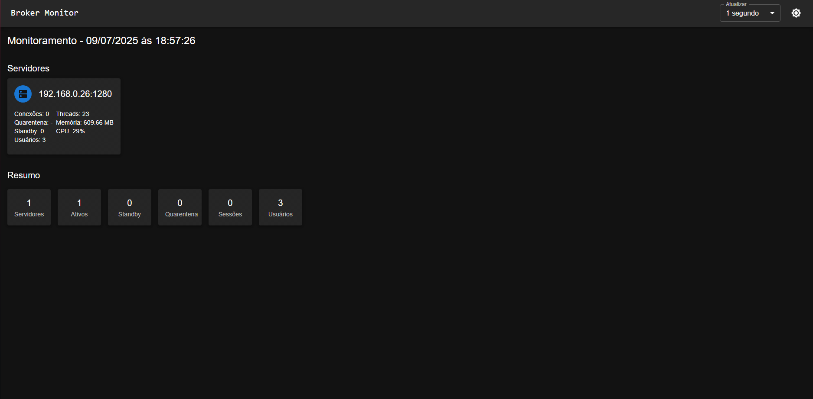

# 🖥️ Broker Monitor TOTVS

Painel de monitoramento visual para o TOTVS Broker, desenvolvido em React com Material UI.

## 📌 Objetivo

Monitorar em tempo real os brokers ativos do Protheus via HTTP, utilizando o endpoint:

```
GET http://<host>:<port>/totvs_broker_query
```

Os dados são consumidos, tratados e apresentados de forma amigável, com alertas visuais e atualização automática configurável.

---

## ⚙️ Funcionalidades

- Consulta via `/totvs_broker_query`
- Verificação do status com `/totvs_broker_query/ping`
- Cards com dados por servidor (CPU, RAM, conexões, etc.)
- Detecção automática de servidores fora do ar (ícone vermelho)
- Resumo com totais de sessões, usuários, standby e quarentena
- Combo box para definir intervalo de atualização (salvo em cache)
- Tema claro/escuro com persistência
- Leitura da configuração do broker via `settings.ini`

---

## 🚀 Tecnologias

- React + Vite
- Material UI (MUI)
- Vite Proxy
- `ini` (parser para ler `settings.ini`)

---

## 🛠️ Instalação

### 1. Clonar o repositório

```bash
git clone https://github.com/seu-usuario/broker-monitor.git
cd broker-monitor
```

### 2. Criar o arquivo de configuração `settings.ini`

```ini
[broker]
host = 127.0.0.1
port = 1281
```

### 3. Instalar dependências

```bash
npm install
```

### 4. Rodar o projeto

```bash
npm run dev
```

---

## 🖼️ Captura de Tela



---

## 📄 Licença

Distribuído sob a licença [MIT](./LICENSE).
